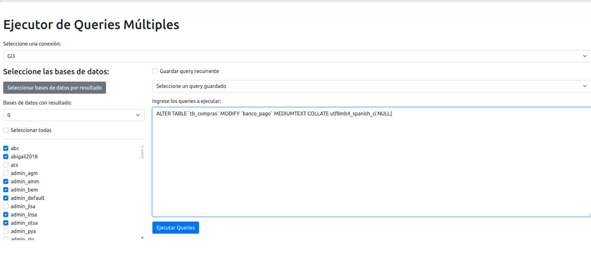

# MultiDB Query Executor (MySQL)

## Capturas de pantalla

<p align="center">
  <a href="./images/1.jpg" target="_blank">
    
  </a>
  <a href="./images/2.jpg" target="_blank">
    
  </a>
</p>

<p align="center">
  <a href="./images/4.jpg" target="_blank">
    
  </a>
  <a href="./images/3.jpg" target="_blank">
    
  </a>
</p>

(Haz clic en las imágenes para verlas en tamaño completo)

## Descripción

MultiDB Query Executor es una herramienta web robusta diseñada para ejecutar y gestionar consultas SQL en múltiples bases de datos simultáneamente. Ofrece una interfaz intuitiva que permite a los usuarios seleccionar bases de datos, ejecutar consultas personalizadas y filtrar bases de datos basándose en los resultados de las consultas.

## Características principales

- Ejecución de consultas en múltiples bases de datos seleccionadas
- Selección inteligente de bases de datos basada en resultados de consultas
- Guardado y carga de consultas frecuentes
- Visualización de progreso en tiempo real
- Capacidad para detener la ejecución de consultas
- Interfaz responsive y fácil de usar

## Instalación

1. Clone el repositorio:
   ```
   git clone https://github.com/your-username/multidb-query-executor.git
   ```

2. Navegue al directorio del proyecto:
   ```
   cd multidb-query-executor
   ```

3. Asegúrese de tener PHP y un servidor web (como Apache) instalados en su sistema.

4. Verifique que SQLite3 esté habilitado en su configuración de PHP:
   - Abra su archivo `php.ini` (la ubicación puede variar dependiendo de su sistema).
   - Busque la línea `;extension=sqlite3` y asegúrese de que esté descomentada (quite el punto y coma al principio si está presente).
   - Si la línea no existe, añádala: `extension=sqlite3`
   - Guarde los cambios y reinicie su servidor web.

5. Configure su archivo `config.json` con las credenciales de sus bases de datos:
   ```json
   {
       "Connection1": {
           "host": "host1.example.com",
           "user": "username1",
           "pass": "password1"
       },
       "Connection2": {
           "host": "host2.example.com",
           "user": "username2",
           "pass": "password2"
       }
   }
   ```

6. Asegúrese de que el directorio del proyecto tenga los permisos adecuados para que PHP pueda crear y escribir en la base de datos SQLite.

7. Inicie su servidor web y navegue a la ubicación del proyecto en su navegador.
   
## Uso

### 1. Selección de conexión

- En la parte superior de la página, seleccione la conexión que desea utilizar del menú desplegable.
- Esto cargará automáticamente las bases de datos disponibles para esa conexión.

### 2. Selección de bases de datos

#### Selección manual
- Marque las casillas junto a las bases de datos que desea incluir en su consulta.
- Puede usar el botón "Seleccionar todas" para marcar o desmarcar todas las bases de datos rápidamente.

#### Selección por resultado de consulta

La selección por resultado de consulta es una poderosa característica que le permite filtrar y seleccionar bases de datos basándose en el resultado de una consulta específica. Esta funcionalidad es especialmente útil cuando necesita identificar rápidamente bases de datos que cumplen ciertos criterios sin tener que verificar cada una manualmente.

**Beneficios:**
- Ahorro de tiempo en la selección de bases de datos relevantes.
- Identificación rápida de bases de datos que cumplen criterios específicos.
- Automatización de procesos de selección basados en el estado de los datos.

**Ejemplos de uso:**

1. **Identificar bases de datos activas:**
   Imagina que tienes múltiples bases de datos de clientes y quieres seleccionar solo aquellas que han tenido actividad reciente.
   ```sql
   SELECT COUNT(*) FROM transacciones WHERE fecha > DATE_SUB(NOW(), INTERVAL 30 DAY)
   ```
   Seleccionando bases de datos con 1 o más resultados, identificarías rápidamente las bases de datos de clientes activos en los últimos 30 días.

2. **Encontrar bases de datos que requieren mantenimiento:**
   Si necesitas identificar bases de datos que tienen tablas que necesitan optimización:
   ```sql
   SELECT 
       CASE 
           WHEN COUNT(*)  > 1000000 THEN 1
           ELSE NULL
       END AS result
   FROM sys_invoices
   HAVING result IS NOT NULL
   ```
   Seleccionando bases de datos con 1 o más resultados, encontrarías aquellas con tablas de más de un millón de filas que podrían necesitar indexación o particionamiento.

3. **Verificar configuraciones:**
   Para asegurarte de que todas tus bases de datos tienen una configuración específica:
   ```sql
   SELECT COUNT(*) FROM configuracion WHERE clave = 'version' AND valor = '2.0'
   ```
   Seleccionando bases de datos con 0 resultados, identificarías aquellas que aún no han sido actualizadas a la versión 2.0.

4. **Auditoría de seguridad:**
   Para identificar bases de datos que podrían tener problemas de seguridad:
   ```sql
   SELECT COUNT(*) FROM usuarios WHERE tipo_acceso = 'admin'
   ```
   Seleccionando bases de datos con más de 1 resultado, podrías identificar rápidamente aquellas con múltiples usuarios administradores, lo que podría requerir una revisión.

**Cómo utilizar esta función:**

- Haga clic en el botón "Seleccionar bases de datos por resultado".
- En el modal que aparece:
  1. Elija si desea seleccionar bases de datos que devuelvan 0 resultados o 1 o más resultados.
  2. Ingrese su consulta en el área de texto.
  3. Opcionalmente, guarde la consulta para uso futuro marcando la casilla "Guardar este query" e ingresando un nombre.
  4. Haga clic en "Ejecutar y seleccionar".
- El sistema ejecutará la consulta en todas las bases de datos y seleccionará automáticamente aquellas que cumplan con el criterio especificado.

Esta función le permite realizar selecciones complejas de bases de datos de manera eficiente, ahorrando tiempo y reduciendo errores en comparación con la selección manual.

### 3. Ejecución de consultas

- Ingrese su consulta SQL en el área de texto principal.
- Si desea guardar la consulta para uso futuro, marque la casilla "Guardar query recurrente" e ingrese un nombre.
- Haga clic en "Ejecutar Queries" para iniciar la ejecución.
- Puede detener la ejecución en cualquier momento haciendo clic en el botón "Detener ejecución".

### 4. Visualización de resultados

- Los resultados se mostrarán en la tabla de "Log de Resultados" en la parte inferior de la página.
- Puede hacer doble clic en las celdas de la tabla para ver el contenido completo en un modal.

### 5. Carga de consultas guardadas

- Use el menú desplegable "Seleccione un query guardado" para cargar consultas previamente guardadas.

## Ventajas

1. **Eficiencia**: Ejecute la misma consulta en múltiples bases de datos con un solo clic, ahorrando tiempo y esfuerzo.

2. **Flexibilidad**: Seleccione bases de datos manualmente o utilice una consulta para filtrar automáticamente las bases de datos relevantes.

3. **Organización**: Guarde y reutilice consultas frecuentes, mejorando la eficiencia y reduciendo errores.

4. **Control**: Visualice el progreso en tiempo real y tenga la capacidad de detener la ejecución en cualquier momento.

5. **Facilidad de uso**: Interfaz intuitiva que no requiere conocimientos técnicos avanzados para su operación.

6. **Escalabilidad**: Diseñado para manejar múltiples conexiones y un gran número de bases de datos.

7. **Seguridad**: Las credenciales de las bases de datos se manejan de forma segura a través de un archivo de configuración separado.

8. **Visualización clara**: Los resultados se presentan de manera organizada y fácil de entender.

9. **Responsividad**: La interfaz se adapta a diferentes tamaños de pantalla, permitiendo su uso en diversos dispositivos.

10. **Modularidad**: El diseño modular permite una fácil extensión y mantenimiento del código.

## Casos de uso

1. **Administradores de bases de datos**: Para realizar mantenimiento y verificaciones en múltiples bases de datos simultáneamente.

2. **Desarrolladores**: Para ejecutar migraciones o scripts de actualización en múltiples entornos.

3. **Analistas de datos**: Para recopilar información de múltiples fuentes de datos rápidamente.

4. **Equipos de soporte**: Para verificar la consistencia de datos en diferentes instancias de bases de datos.

5. **Auditores**: Para ejecutar consultas de auditoría en múltiples bases de datos de forma eficiente.

## Consideraciones técnicas

- El proyecto está desarrollado principalmente en PHP para el backend y utiliza jQuery para las interacciones del frontend.
- Se utiliza Bootstrap para el diseño responsive de la interfaz.
- Las consultas se ejecutan de forma asíncrona para evitar bloqueos del navegador durante operaciones largas.
- Los resultados se almacenan temporalmente en una base de datos SQLite para una recuperación rápida.

## Limitaciones y consideraciones de seguridad

- Asegúrese de que el archivo `config.json` tenga permisos restrictivos y no sea accesible públicamente.
- Las consultas se ejecutan con los privilegios de los usuarios especificados en el archivo de configuración. Asegúrese de utilizar cuentas con los permisos mínimos necesarios.
- Evite ejecutar consultas que puedan modificar o eliminar datos a menos que esté seguro de las consecuencias.
- El sistema no proporciona un método para crear o modificar conexiones de base de datos a través de la interfaz web por razones de seguridad.

## Contribuciones

Las contribuciones son bienvenidas. Por favor, abra un issue para discutir cambios mayores antes de enviar un pull request.

## Licencia

Este proyecto está licenciado bajo la Licencia MIT. Consulte el archivo LICENSE para más detalles.

---

# MultiDB Query Executor (MySQL)

## Description

MultiDB Query Executor is a robust web-based tool designed for executing and managing SQL queries across multiple databases simultaneously. It provides an intuitive interface that allows users to select databases, run custom queries, and filter databases based on query results.

## Key Features

- Execution of queries on multiple selected databases
- Intelligent database selection based on query results
- Saving and loading of frequently used queries
- Real-time progress visualization
- Ability to stop query execution
- Responsive and user-friendly interface

## Installation

1. Clone the repository:
   ```
   git clone https://github.com/your-username/multidb-query-executor.git
   ```

2. Navigate to the project directory:
   ```
   cd multidb-query-executor
   ```

3. Ensure you have PHP and a web server (such as Apache) installed on your system.

4. Verify that SQLite3 is enabled in your PHP configuration:
   - Open your `php.ini` file (location may vary depending on your system).
   - Look for the line `;extension=sqlite3` and make sure it's uncommented (remove the semicolon at the beginning if present).
   - If the line doesn't exist, add it: `extension=sqlite3`
   - Save the changes and restart your web server.

5. Configure your `config.json` file with your database credentials:
   ```json
   {
       "Connection1": {
           "host": "host1.example.com",
           "user": "username1",
           "pass": "password1"
       },
       "Connection2": {
           "host": "host2.example.com",
           "user": "username2",
           "pass": "password2"
       }
   }
   ```

6. Ensure that the project directory has the appropriate permissions for PHP to create and write to the SQLite database.

7. Start your web server and navigate to the project location in your browser.

## Usage

### 1. Connection Selection

- At the top of the page, select the connection you want to use from the dropdown menu.
- This will automatically load the available databases for that connection.

### 2. Database Selection

#### Manual Selection
- Check the boxes next to the databases you want to include in your query.
- You can use the "Select All" button to quickly check or uncheck all databases.

#### Selection by Query Result

Selection by query result is a powerful feature that allows you to filter and select databases based on the result of a specific query. This functionality is especially useful when you need to quickly identify databases that meet certain criteria without having to manually check each one.

**Benefits:**
- Time-saving in selecting relevant databases.
- Quick identification of databases that meet specific criteria.
- Automation of selection processes based on data status.

**Usage Examples:**

1. **Identify Active Databases:**
   Imagine you have multiple customer databases and want to select only those that have had recent activity.
   ```sql
   SELECT COUNT(*) FROM transactions WHERE date > DATE_SUB(NOW(), INTERVAL 30 DAY)
   ```
   By selecting databases with 1 or more results, you would quickly identify databases of customers active in the last 30 days.

2. **Find Databases Requiring Maintenance:**
   If you need to identify databases that have tables needing optimization:
   ```sql
   SELECT 
       CASE 
           WHEN COUNT(*)  > 1000000 THEN 1
           ELSE NULL
       END AS result
   FROM sys_invoices
   HAVING result IS NOT NULL
   ```
   By selecting databases with 1 or more results, you would find those with tables of more than a million rows that might need indexing or partitioning.

3. **Verify Configurations:**
   To ensure all your databases have a specific configuration:
   ```sql
   SELECT COUNT(*) FROM configuration WHERE key = 'version' AND value = '2.0'
   ```
   By selecting databases with 0 results, you would identify those that haven't yet been updated to version 2.0.

4. **Security Audit:**
   To identify databases that might have security issues:
   ```sql
   SELECT COUNT(*) FROM users WHERE access_type = 'admin'
   ```
   By selecting databases with more than 1 result, you could quickly identify those with multiple admin users, which might require review.

**How to Use This Feature:**

- Click on the "Select databases by result" button.
- In the modal that appears:
  1. Choose whether you want to select databases that return 0 results or 1 or more results.
  2. Enter your query in the text area.
  3. Optionally, save the query for future use by checking the "Save this query" box and entering a name.
  4. Click "Execute and Select".
- The system will run the query on all databases and automatically select those that meet the specified criteria.

This feature allows you to perform complex database selections efficiently, saving time and reducing errors compared to manual selection.

### 3. Query Execution

- Enter your SQL query in the main text area.
- If you want to save the query for future use, check the "Save recurring query" box and enter a name.
- Click "Execute Queries" to start the execution.
- You can stop the execution at any time by clicking the "Stop execution" button.

### 4. Viewing Results

- Results will be displayed in the "Results Log" table at the bottom of the page.
- You can double-click on table cells to view the full content in a modal.

### 5. Loading Saved Queries

- Use the "Select a saved query" dropdown to load previously saved queries.

## Advantages

1. **Efficiency**: Execute the same query across multiple databases with a single click, saving time and effort.

2. **Flexibility**: Select databases manually or use a query to automatically filter relevant databases.

3. **Organization**: Save and reuse frequent queries, improving efficiency and reducing errors.

4. **Control**: Visualize progress in real-time and have the ability to stop execution at any time.

5. **Ease of Use**: Intuitive interface that doesn't require advanced technical knowledge to operate.

6. **Scalability**: Designed to handle multiple connections and a large number of databases.

7. **Security**: Database credentials are handled securely through a separate configuration file.

8. **Clear Visualization**: Results are presented in an organized and easy-to-understand manner.

9. **Responsiveness**: The interface adapts to different screen sizes, allowing use on various devices.

10. **Modularity**: The modular design allows for easy extension and maintenance of the code.

## Use Cases

1. **Database Administrators**: For performing maintenance and checks across multiple databases simultaneously.

2. **Developers**: For running migrations or update scripts across multiple environments.

3. **Data Analysts**: For gathering information from multiple data sources quickly.

4. **Support Teams**: For checking data consistency across different database instances.

5. **Auditors**: For running audit queries across multiple databases efficiently.

## Technical Considerations

- The project is primarily developed in PHP for the backend and uses jQuery for frontend interactions.
- Bootstrap is used for the responsive design of the interface.
- Queries are executed asynchronously to avoid browser locks during long operations.
- Results are temporarily stored in a SQLite database for quick retrieval.

## Limitations and Security Considerations

- Ensure that the `config.json` file has restrictive permissions and is not publicly accessible.
- Queries are executed with the privileges of the users specified in the configuration file. Be sure to use accounts with the minimum necessary permissions.
- Avoid running queries that may modify or delete data unless you are sure of the consequences.
- The system does not provide a method to create or modify database connections through the web interface for security reasons.

## Contributions

Contributions are welcome. Please open an issue to discuss major changes before submitting a pull request.

## License

This project is licensed under the MIT License. See the LICENSE file for more details.
